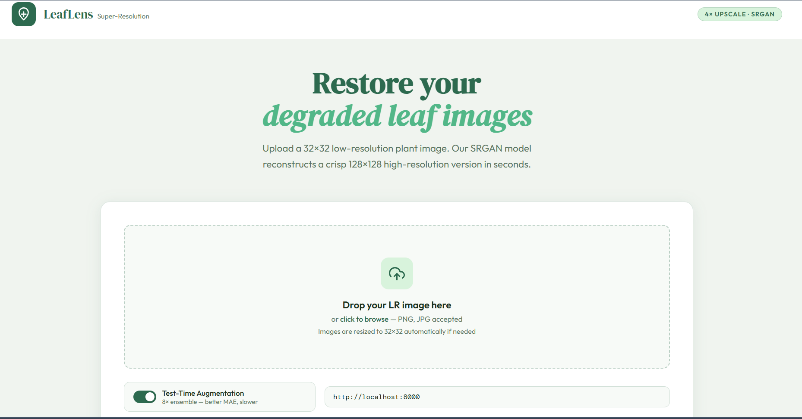
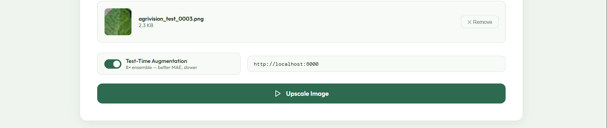
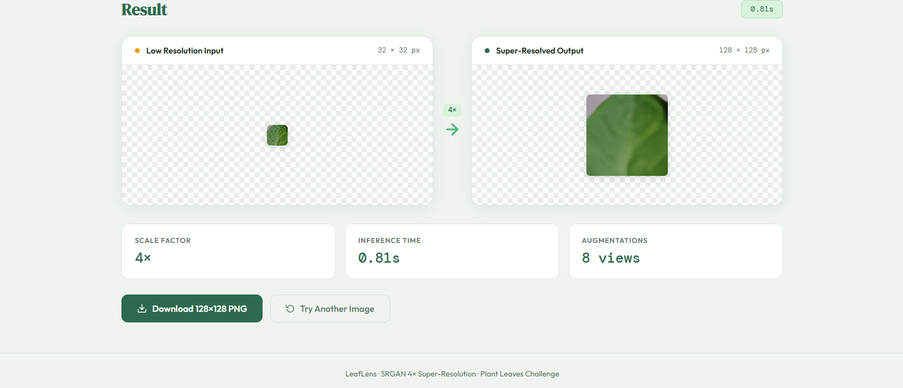
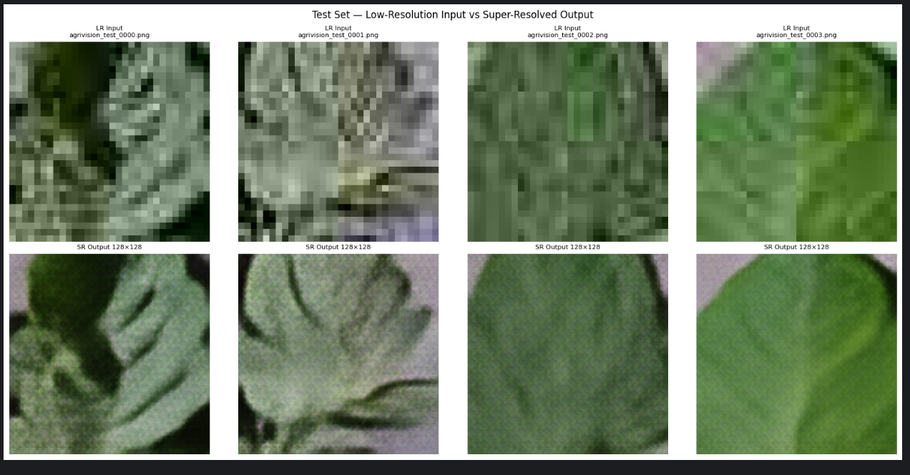

# LeafLens — Plant Super-Resolution Deployment 🌿

  AI-powered plant image super-resolution system built using SRGAN-style deep learning architecture for enhancing low-resolution leaf images into high-quality outputs.

  
  
  
  

---
## 🌐 Live Demo

🚀 **Deployed on Render using Docker containerization**

🔗 Live Application:  
[https://plant-super-resolution.onrender.com/](https://plant-super-resolution.onrender.com/)

The application is fully containerized using Docker for consistent deployment and environment reproducibility across systems.

---
# 🚀 Features

- 4× AI-powered image super-resolution
- SRGAN-style deep learning generator architecture
- FastAPI backend for inference
- Lightweight frontend with zero dependencies
- Test-Time Augmentation (TTA) support
- Real-time image enhancement workflow
- Dockerized deployment architecture
- Render cloud deployment integration
- Containerized backend environment
- PNG/JPG upload support
- Downloadable enhanced output images

Because blurry plant images apparently offended humanity enough for us to train neural networks on leaves.

---
# 💻 Frontend Interface

  

  

  

# 🖼️ Demo Preview

## Input vs Super-Resolved Output

  
  

---

The frontend allows users to:

- Upload low-resolution leaf images
- Enable/disable Test-Time Augmentation
- Send images to the FastAPI inference server
- View enhanced 128×128 output
- Download processed images instantly

No npm. No React build trauma. No 14GB `node_modules` folder summoning demons from the storage dimension.

---

# 🧠 Model Architecture

The Generator network follows an SRGAN-inspired architecture optimized for image reconstruction tasks.

## Architecture Details

- **Input Resolution:** 32×32 RGB
- **Output Resolution:** 128×128 RGB
- **Scaling Factor:** 4×
- **Residual Blocks:** 16
- **Upsampling Layers:** 2 × PixelShuffle
- **Activation:** PReLU
- **Normalization:** Batch Normalization
- **Framework:** PyTorch

## Pipeline

    Low Resolution Image
            ↓
    Initial Convolution Layer
            ↓
    16 Residual Blocks
            ↓
    Global Skip Connection
            ↓
    PixelShuffle Upsampling
            ↓
    Reconstructed High Resolution Output

---

# 📂 Project Structure

    LeafLens/
    │
    ├── sr_backend/
    │   ├── app.py
    │   ├── notebook_save_cell.py
    │   ├── best_generator.pth
    │   └── model_metadata.json
    │
    ├── sr_frontend/
    │   ├── index.html
    │   ├── styles.css
    │   └── script.js
    │
    ├── images/
    │   ├── banner.png
    │   ├── ui.png
    │   ├── input.png
    │   └── output.png
    │
    └── README.md

---

# ⚙️ Backend Setup

## Install Dependencies

    pip install fastapi uvicorn pillow torch torchvision python-multipart

## Run FastAPI Server

    MODEL_PATH=best_generator.pth uvicorn app:app --host 0.0.0.0 --port 8000

## Test Backend Health

    curl http://localhost:8000/health

---

# 🌐 Frontend Setup

Simply open:

    index.html

inside any browser.

No build tools required.

## Steps

1. Enter backend API URL
2. Upload leaf image
3. Enable Test-Time Augmentation (optional)
4. Click **Upscale Image**
5. Download enhanced output

Humanity invented 17 JavaScript frameworks just to eventually rediscover plain HTML files.

---

# 🔬 Test-Time Augmentation (TTA)

The system supports 8× geometric Test-Time Augmentation:

- 4 rotations
- Horizontal flipping
- Reverse transform averaging

This improves reconstruction quality and reduces prediction artifacts.

## TTA Workflow

    Input Image
        ↓
    Apply Geometric Transforms
        ↓
    Run Inference on Each Variant
        ↓
    Reverse Transform Outputs
        ↓
    Average Predictions
        ↓
    Final Enhanced Output

---

# 📡 API Reference

## POST `/predict`

### Request

| Field | Type | Description |
|------|------|------|
| file | binary | PNG/JPG image |
| use_tta | bool | Enable TTA inference |

### Response

    image/png

Returns:

- 128×128 enhanced image

---

## GET `/health`

Returns:

    {
      "model_loaded": true,
      "device": "cuda"
    }

---

# 📈 Training Details

- Framework: PyTorch
- Loss Strategy: Reconstruction-focused optimization
- Dataset: Plant/leaf image dataset
- Hardware: GPU-enabled training environment

## Exported Formats

- `.pth`
- TorchScript `.pt`
- JSON metadata

---

# 📸 Results

| Metric | Value |
|------|------|
| Input Size | 32×32 |
| Output Size | 128×128 |
| Upscaling Factor | 4× |
| Inference API | FastAPI |
| Deployment Style | Lightweight |

---

# 🛠️ Tech Stack

## Backend

- Python
- FastAPI
- PyTorch
- TorchVision
- Pillow

## Frontend

- HTML
- CSS
- JavaScript

## Deployment

- Docker
- Render
- Uvicorn
- REST API Architecture

---

# 📌 Future Improvements

- GAN discriminator integration
- Mobile optimization
- Batch image processing
- Docker deployment
- Cloud inference pipeline
- Real-time webcam enhancement
- Leaf disease classification integration

Because once engineers successfully upscale leaves, the next logical step is apparently teaching plants computer vision.

---

# 👨‍💻 Author

## Saurabh Vishwakarma

Machine Learning & AI Developer focused on:

- Deep Learning
- Computer Vision
- AI Systems
- Full Stack ML Applications

---

# ⭐ Support

If you found this project useful, consider giving it a star.
